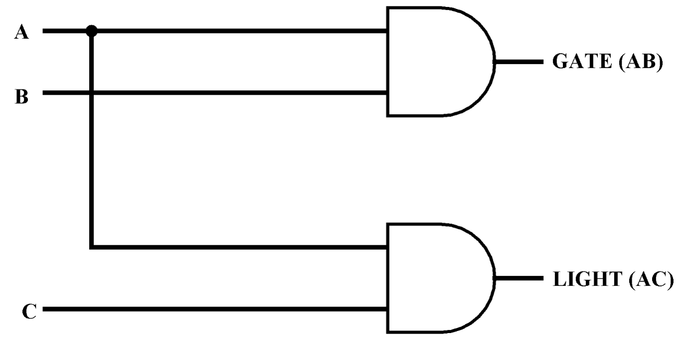
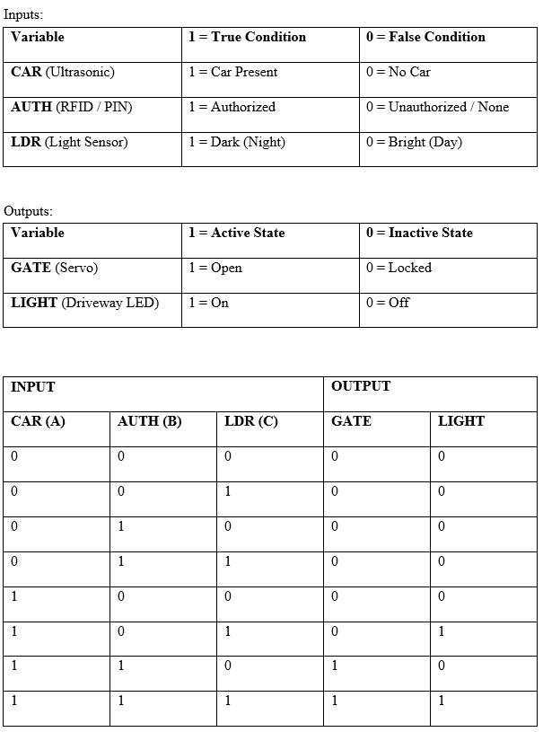

# Smart Gate & Automated Lighting System

An IoT-enabled access control and automated perimeter lighting system engineered for real-time security management. The system integrates dual-factor authorization (RFID and 4x4 Keypad PIN), vehicle proximity sensing, and ambient light monitoring controlled via an Arduino Uno micro-controller.

---

## 📸 System Architecture & Visuals

### 1. Hardware & IoT Simulation Setup
The complete embedded hardware design modeled in Wokwi, featuring the ATmega328P microcontroller connected to I2C LCD, RFID RC522, Keypad, Servo motor, Ultrasonic sensor, and LDR light module.

---

### 2. Digital Logic & Circuit Schematic
The core combinational logic controlling automated gate activation and driveway illumination based on system sensor inputs.

---

## 🧮 Theoretical Logic Analysis

The system’s core decision-making functions are derived from boolean reduction principles to optimize hardware execution speed and combinational logic design.

### Truth Table Analysis
Input conditions mapped across sensor states (Vehicle Proximity $A$, Access Verification $B$, Dark Ambient Light $C$):

### Karnaugh Map Minimization
K-map simplification used to extract optimized Boolean expressions for system outputs:

* **Gate Output ($GATE$):** $GATE = A \cdot B$
* **Driveway Light Output ($LIGHT$):** $LIGHT = A \cdot C$

---

## 🛠️ Hardware Specification & Pin Mapping

| Peripheral | Component | Pin Mapping (Arduino Uno) | Description / Function |
| :--- | :--- | :--- | :--- |
| **Microcontroller** | ATmega328P | — | Central Controller |
| **Display** | 1602 LCD (I2C) | SDA (`A4`), SCL (`A5`) | System status output |
| **Proximity Sensor** | HC-SR04 | Signal Pin (`2`) | Vehicle detection (< 50 cm) |
| **Actuator** | Micro Servo (SG90) | PWM Pin (`6`) | Automated gate barrier mechanism |
| **RFID Reader** | MFRC522 | SDA (`10`), MOSI (`11`), MISO (`12`), SCK (`13`), RST (`3.3V`) | SPI authentication for Owner card |
| **Keypad** | 4x4 Membrane | Rows: `A1, A2, A3, 3`   Cols: `0, 1, 4, 5` | PIN authorization for VIP access |
| **Light Sensor** | LDR Module | Analog Pin (`A0`) | Ambient lighting detection |
| **Indicators** | 5mm LEDs | Green (`7`), Red (`8`), White (`9`) | Status feedback (Granted / Denied / Light) |

---

## ⚡ Key System Features

1. **Automated Vehicle Detection**: Continuously monitors arrival zone via ultrasonic distance pulse timing.
2. **Multi-Factor Authentication**:
   * **RFID Interface**: Instantly reads owner tag UID.
   * **Keypad Interface**: Accepts 4-digit passcode (`1234`) with `#` (Enter) and `*` (Clear).
3. **Smart Driveway Illumination**: LDR threshold activates white high-efficiency auxiliary lighting only when a vehicle is present during low-light/nighttime conditions.
4. **Visual & Haptic Gate Control**: Drives servo rotation (0° to 90°) with status messages displayed on the 16x2 I2C LCD screen alongside status LEDs.

---

## 📄 Project Documentation

For comprehensive technical analysis, state machine diagrams, and project documentation, refer to the included report:

👉 **[Download Full Project Report (PDF)](./documentation/project-report.pdf)**

---

## 🚀 Installation & Simulation Setup

### Running in Wokwi Simulator
1. Open the project in Wokwi or launch locally using Wokwi CLI from the project root.
2. Load `simulation/sketch.ino`, `simulation/diagram.json`, and `simulation/wokwi.toml`.
3. Press **Start Simulation**.

### Compiling via Arduino IDE
1. Open `src/smart-gate-system.ino` in **Arduino IDE**.
2. Ensure the following libraries are installed:
   * `LiquidCrystal_I2C`
   * `MFRC522`
   * `Keypad`
   * `Servo`
3. Select **Tools > Board > Arduino Uno** and pick your target COM Port.
4. Click **Upload**.

---

## 📜 License

This project is open-source and licensed under the terms of the [MIT License](LICENSE).